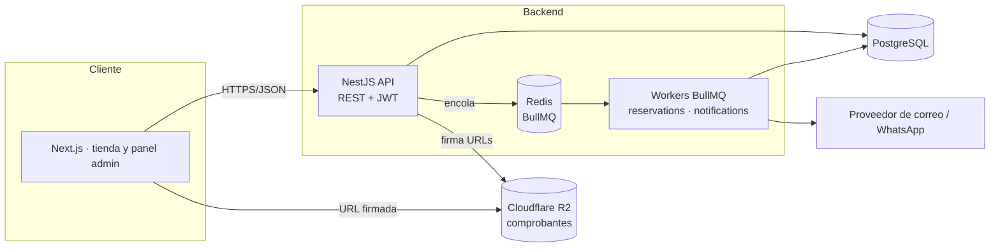
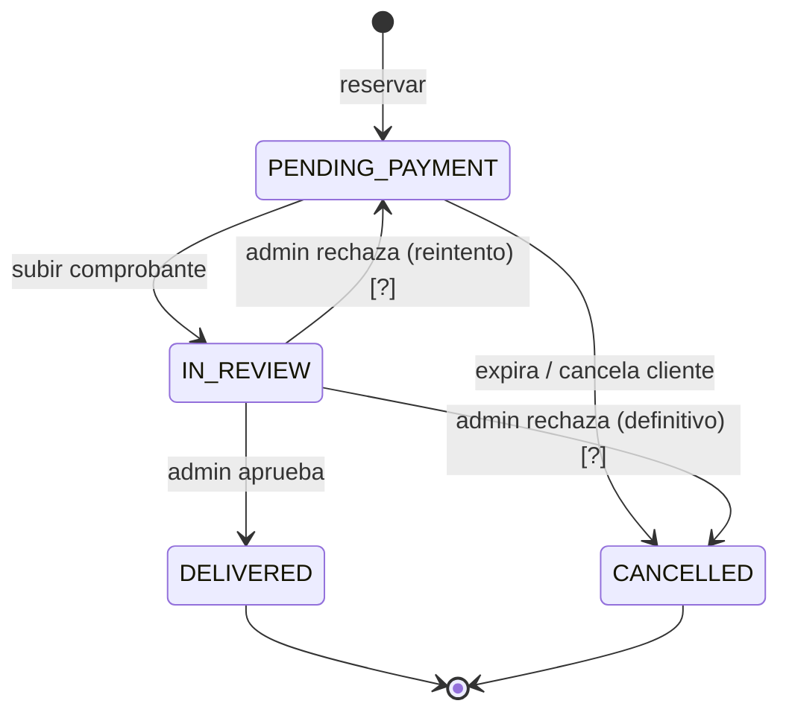
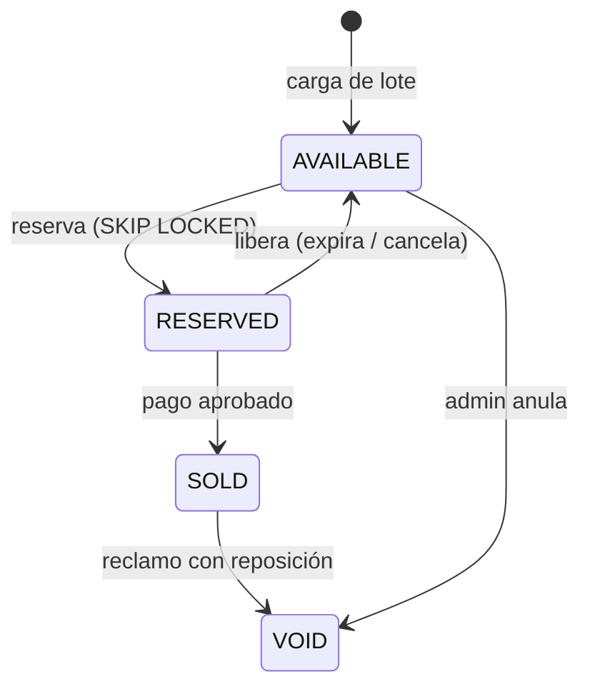
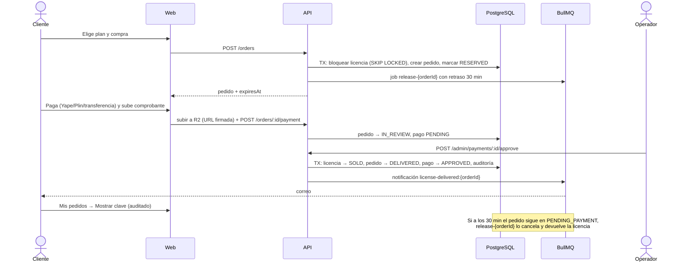

# 04 · Arquitectura

## Visión general

**Estado hoy:** `api/` implementada (Sprint 1). `web/` sin crear. R2, correo y WhatsApp sin integrar.

## Stack
| Capa | Tecnología | Nota |
|---|---|---|
| API | NestJS 11 (TypeScript), REST | Módulos por dominio |
| ORM / BD | TypeORM 0.3 + PostgreSQL 16 | Migraciones versionadas |
| Colas | BullMQ + Redis 7 | Reservas y notificaciones |
| Auth | JWT (passport-jwt) + bcryptjs + roles | |
| Cifrado | AES-256-GCM (módulo `crypto` de Node) | |
| Web (por crear) | Next.js (App Router) + TypeScript | Estilos por decidir (Tailwind propuesto) |
| Pruebas | Jest + Supertest | e2e contra Postgres/Redis reales |
| Local | Docker Compose (Postgres + Redis) | |
| Prod (propuesto) | Render · Vercel · Neon · Upstash · R2 | |

> **Versiones fijadas:** `@nestjs/config@4`, `@nestjs/jwt@11`, `@nestjs/passport@11`, `@nestjs/bullmq@11`, `@nestjs/typeorm@11`.
> Las v12 son solo ESM y rompen con Jest/CommonJS. Prisma se descartó en el entorno de desarrollo del Sprint 1 por descarga de motores bloqueada; **no es una decisión de producto**.

## Estructura del código (`api/src`)
```
app.module.ts            Raíz; /health
main.ts                  ValidationPipe global, CORS, shutdown hooks
common/                  CryptoService (AES-GCM + hash)
auth/                    register/login/me, JwtStrategy, guards, @Roles, @CurrentUser
database/
  entities/              12 entidades TypeORM
  enums.ts               Estados y roles
  migrations/            Migración inicial
  data-source*.ts        Config compartida app + CLI
  seed.ts                Admin + producto demo
orders/                  OrdersService (reserva, liberación, barrido), processor, controller
notifications/           Cola con idempotencia (notification_logs)
queues/                  Conexión Redis, constantes (TTL 30 min, barrido 5 min)
```
Módulos pendientes: `catalog`, `inventory`, `payments`, `claims`, `admin`, `storage` (R2), `reports`.

## Máquinas de estado

### Pedido (`OrderStatus`)

### Licencia (`LicenseStatus`)

### Pago (`PaymentStatus`) y reclamo (`ClaimStatus`)
- Pago: `PENDING → APPROVED | REJECTED`.
- Reclamo: `OPEN → RESOLVED | REJECTED`.

| Evento | Pedido | Licencia | Pago |
|---|---|---|---|
| Reservar | → PENDING_PAYMENT | AVAILABLE → RESERVED | — |
| Subir comprobante | → IN_REVIEW | — | crea PENDING |
| Aprobar | → DELIVERED | RESERVED → SOLD | → APPROVED |
| Rechazar | [?] | [?] | → REJECTED |
| Expirar sin pago | → CANCELLED | RESERVED → AVAILABLE | — |

## Flujo principal


## Decisiones técnicas clave
1. **Reserva sin carreras:** `SELECT … FOR UPDATE SKIP LOCKED` dentro de una transacción. Cada comprador bloquea una licencia distinta o recibe 409.
2. **Liberación diferida + idempotente:** job `release-{orderId}`; el handler relee el estado con bloqueo de fila y solo actúa si sigue `PENDING_PAYMENT`.
3. **Red de seguridad:** job repetible `sweep-expired` cada 5 min (BullMQ `upsertJobScheduler`) libera lo vencido si Redis perdió algún job.
4. **PostgreSQL manda:** Redis solo coordina tiempos; perderlo no corrompe el negocio.
5. **Cifrado de claves** con AES-256-GCM; hash SHA-256 aparte para duplicados.
6. **Notificaciones idempotentes:** `jobId` único + fila en `notification_logs` (se reclama antes de enviar y se libera si el envío falla).
7. **Reserva de 1 licencia por pedido** en el MVP (el esquema admite más).

## Seguridad en capas
Red (HTTPS, CORS) → autenticación (JWT) → autorización (rol + propiedad) → validación (DTO whitelist) → datos (cifrado, transacciones, restricciones únicas) → auditoría.

## Despliegue (propuesto)
| Servicio | Plataforma | Variables clave |
|---|---|---|
| API + workers | Render (web service) | `DATABASE_URL` (+`DB_SSL=true`), `REDIS_URL` (`rediss://`), `JWT_SECRET`, `LICENSE_ENC_KEY`, `CORS_ORIGIN` |
| Web | Vercel | URL de la API, secreto de sesión |
| BD | Neon | pooled connection recomendada |
| Redis | Upstash / Redis Cloud | TLS |
| Archivos | Cloudflare R2 | credenciales S3-compatibles, bucket privado |

Despliegue: `npm run build` → `npm run migration:run` → `node dist/main`.

> **Pendiente de despliegue:** `npm run migration:run` usa `ts-node` (devDependency). En producción conviene ejecutar las
> migraciones con el JS compilado: `typeorm migration:run -d dist/database/data-source.js`, o instalar devDependencies en el paso de build.
