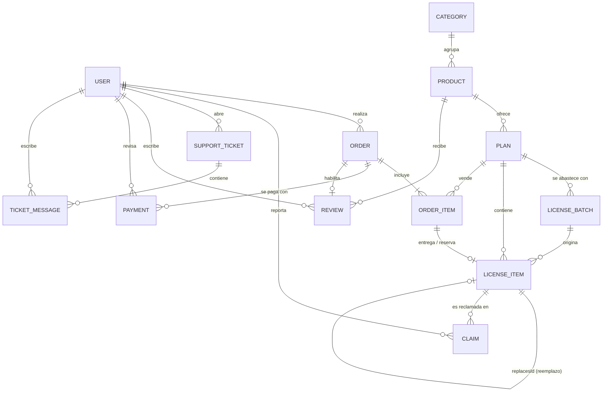

# 05 · Modelo de datos

Fuente de verdad: `api/src/database/entities/*.ts` y `api/src/database/migrations/`.
Convenciones: PK `uuid`; fechas `timestamptz`; dinero en **céntimos (int)**; enums nativos de PostgreSQL.

Decisiones de esquema de esta sección provienen del brainstorming de Sprint 2–4 (`docs/09`, D14–D52).



## Tablas

| Tabla | Propósito | Columnas relevantes |
|---|---|---|
| `users` | Cuentas | `email` único (minúsculas), `passwordHash` **nullable** (vacío en cuentas solo-Google), `googleId` **único, nullable** (D53), `name`, `role` (CUSTOMER/ADMIN), `phone`, `emailVerifiedAt` (auto si viene de Google, D54) |
| `categories` | Agrupación del catálogo | `name` único |
| `products` | Herramienta | `name`, `slug` único, `description`, `active`, `categoryId`, `requiresToolUsername` (bool, D14) |
| `plans` | Variante comprable | `productId`, `name`, `kind` (NEW/RENEWAL), `durationDays`, `priceCents`, `currency` (default `'PEN'`, D51), `lowStockThreshold` (def. 5), `active` |
| `license_batches` | Compra a proveedor | `planId`, `supplier`, `unitCostCents`, `notes`, `purchasedAt` |
| `license_items` | **Una licencia vendible** | `planId`, `batchId`, `secretEncrypted`, `secretHash` **único**, `status`, `reservedUntil`, `orderItemId` **único entre activas** (ver índice parcial), `soldAt`, `replacesId` (nullable, D28) |
| `orders` | Pedido | `userId`, `orderNumber` (secuencia legible), `status`, `totalCents`, `currency` (default `'PEN'`, D51), `toolUsername`, `expiresAt`, `cancelReason` |
| `order_items` | Línea de pedido (ya soporta carrito, D30) | `orderId`, `planId`, `unitPriceCents` |
| `payments` | Comprobante y revisión | `orderId`, `method`, `proofUrl`, `proofHash` **único** (D21), `operationNumber` **único** (D20/D21), `status`, `rejectionReason`, `reviewedById`, `reviewedAt` |
| `claims` | Reclamo de clave inválida | `licenseItemId`, `userId`, `reason`, `status`, `replacementLicenseId`, `resolvedById`, `resolvedAt` |
| `support_tickets` | Ticket de soporte general (D34) | `userId`, `subject`, `status` (OPEN/CLOSED), `createdAt` |
| `ticket_messages` | Mensaje dentro de un ticket (D34) | `ticketId`, `authorId`, `body`, `isAdmin` (bool), `createdAt` |
| `reviews` | Reseña de producto (D33) | `productId`, `userId`, `orderId`, `rating` (1–5), `body`, `status` (PENDING/APPROVED/HIDDEN), `createdAt` |
| `settings` | Configuración clave/valor (TTL, horario, SLA, monto máx. cliente nuevo) | `key` **único**, `value` (jsonb) |
| `audit_logs` | Quién hizo qué | `actorId`, `action`, `entity`, `entityId`, `meta` (jsonb) |
| `notification_logs` | Idempotencia de envíos | `key` **único**, `channel`, `recipient`, `template` |

## Índices y restricciones que sostienen las reglas de negocio
- `license_items(planId, status)` → contar y bloquear stock disponible rápido.
- `license_items.secretHash` único → no se puede cargar dos veces la misma clave.
- `license_items.orderItemId`: índice **único parcial** `WHERE status IN ('RESERVED','SOLD')` → una línea de pedido activa tiene, como máximo, una licencia activa; una licencia `VOID` por reposición conserva su `orderItemId` histórico sin bloquear al reemplazo (D28).
- `payments.operationNumber` único, `payments.proofHash` único → bloqueo automático de comprobantes reutilizados (D21).
- `payments.status` único activo por pedido (a lo sumo un `PENDING` por `orderId`).
- `orders(status, expiresAt)` → el barrido localiza reservas vencidas sin escanear todo.
- `orders.orderNumber` único, autoincremental legible (p. ej. `#1042`).
- `claims`: índice único parcial `WHERE status='OPEN'` por `orderId` → invariante 6.
- `payments(status)`, `claims(status)`, `support_tickets(status)` → colas del panel admin.
- `audit_logs(entity, entityId)` → historial de cualquier objeto.
- `settings.key` único.

## Invariantes (deben cumplirse siempre; hay o debe haber prueba)
1. Una licencia `RESERVED`/`SOLD` tiene `orderItemId`; una `AVAILABLE` no lo tiene.
2. Una licencia `AVAILABLE` no tiene `reservedUntil`.
3. Un pedido `DELIVERED` tiene todas sus licencias en `SOLD` y su pago en `APPROVED`.
4. Un pedido `IN_REVIEW` mantiene sus licencias reservadas (no se libera por expiración).
5. `totalCents` = suma de `unitPriceCents` de sus líneas (precio congelado al comprar; cambios de precio no afectan pedidos existentes).
6. Nunca hay dos reclamos `OPEN` sobre el mismo pedido.
7. Toda licencia de reemplazo (`replacesId` no nulo) apunta a una licencia `VOID` por reclamo resuelto; la original nunca se reutiliza.
8. Todas las líneas (`order_items`) de un mismo pedido comparten la misma `currency` que el pedido.
9. Un producto con `requiresToolUsername = true` exige `orders.toolUsername` no nulo antes de pasar a `IN_REVIEW`.
10. Todo `user` tiene `passwordHash` **o** `googleId` (nunca ambos nulos).

## Cálculo de estado de stock (catálogo)
```
disponibles = COUNT(license_items WHERE planId = :id AND status = 'AVAILABLE')
estado = disponibles = 0 ? 'Agotado' : disponibles <= plan.lowStockThreshold ? 'Pocas unidades' : 'En stock'
```
El catálogo público solo expone `estado` (D29), nunca `disponibles`.
Margen por venta = `order_items.unitPriceCents − license_batches.unitCostCents` (vía `license_items.batchId`).

## Pendiente deliberadamente (no implementar aún)
- `license_items.keyVersion` (rotación de llave de cifrado) — diferido, D50.
- Separación de roles ADMIN/OWNER — diferido, D35.
