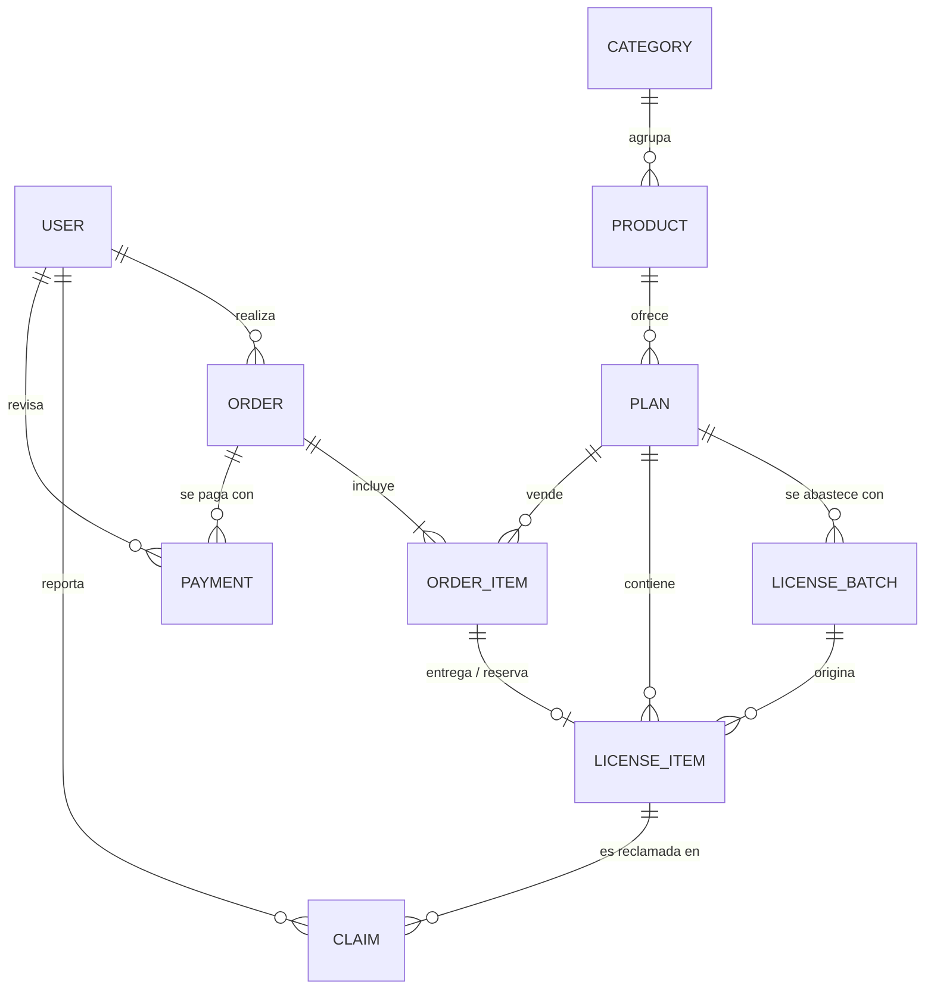

# 05 · Modelo de datos

Fuente de verdad: `api/src/database/entities/*.ts` y `api/src/database/migrations/`.
Convenciones: PK `uuid`; fechas `timestamptz`; dinero en **céntimos (int)**; enums nativos de PostgreSQL.



## Tablas

| Tabla | Propósito | Columnas relevantes |
|---|---|---|
| `users` | Cuentas | `email` único (minúsculas), `passwordHash`, `name`, `role` (CUSTOMER/ADMIN) |
| `categories` | Agrupación del catálogo | `name` único |
| `products` | Herramienta | `name`, `slug` único, `description`, `active`, `categoryId` |
| `plans` | Variante comprable | `productId`, `name`, `kind` (NEW/RENEWAL), `durationDays`, `priceCents`, `lowStockThreshold` (def. 5), `active` |
| `license_batches` | Compra a proveedor | `planId`, `supplier`, `unitCostCents`, `notes`, `purchasedAt` |
| `license_items` | **Una licencia vendible** | `planId`, `batchId`, `secretEncrypted`, `secretHash` **único**, `status`, `reservedUntil`, `orderItemId` **único**, `soldAt` |
| `orders` | Pedido | `userId`, `status`, `totalCents`, `toolUsername`, `expiresAt` |
| `order_items` | Línea de pedido | `orderId`, `planId`, `unitPriceCents` |
| `payments` | Comprobante y revisión | `orderId`, `method`, `proofUrl`, `status`, `rejectionReason`, `reviewedById`, `reviewedAt` |
| `claims` | Reclamo de clave inválida | `licenseItemId`, `userId`, `reason`, `status`, `replacementLicenseId`, `resolvedById`, `resolvedAt` |
| `audit_logs` | Quién hizo qué | `actorId`, `action`, `entity`, `entityId`, `meta` (jsonb) |
| `notification_logs` | Idempotencia de envíos | `key` **único**, `channel`, `recipient`, `template` |

## Índices y restricciones que sostienen las reglas de negocio
- `license_items(planId, status)` → contar y bloquear stock disponible rápido.
- `license_items.secretHash` único → no se puede cargar dos veces la misma clave.
- `license_items.orderItemId` único → una línea de pedido tiene, como máximo, una licencia.
- `orders(status, expiresAt)` → el barrido localiza reservas vencidas sin escanear todo.
- `payments(status)`, `claims(status)` → colas del panel admin.
- `audit_logs(entity, entityId)` → historial de cualquier objeto.

## Invariantes (deben cumplirse siempre; hay o debe haber prueba)
1. Una licencia `RESERVED`/`SOLD` tiene `orderItemId`; una `AVAILABLE` no lo tiene.
2. Una licencia `AVAILABLE` no tiene `reservedUntil`.
3. Un pedido `DELIVERED` tiene su licencia en `SOLD` y su pago `APPROVED`.
4. Un pedido `IN_REVIEW` mantiene su licencia reservada (no se libera por expiración).
5. `totalCents` = suma de `unitPriceCents` de sus líneas (precio congelado al comprar; cambios de precio no afectan pedidos existentes).
6. Nunca hay dos reclamos `OPEN` sobre el mismo pedido.

## Cambios de esquema previstos (a decidir en el brainstorming)
| Cambio | Motivo | Requerimiento |
|---|---|---|
| `orders.orderNumber` (secuencia legible, p. ej. `#1042`) | La UI muestra "Pedido [N.º]"; el UUID no es amigable. | RF-PED-01 |
| `products.requiresToolUsername` (bool) o a nivel de `plans` | Distinguir activación por cuenta de entrega de clave. | RF-COM-07 |
| `license_items.keyVersion` | Rotación de la llave de cifrado. | RNF-SEG-11 |
| Relación del reemplazo: `license_items.replacesId` **o** permitir reasignar `orderItemId` al anular la original | Hoy `orderItemId` es único y la original `VOID` lo conserva; el reemplazo no puede apuntar a la misma línea. | RF-ADM-31 |
| `orders.cancelReason` y `payments.proofHash` | Trazabilidad de cancelaciones y detección de comprobantes repetidos. | RF-ADM-15 |
| `users.phone` | Soporte y WhatsApp. | RF-AUT-08 |
| Tabla `settings` (clave/valor) | TTL, horario, datos de pago, SLA de revisión editables sin desplegar. | RF-ADM-42 |
| `payments.status` único activo por pedido | Evitar dos comprobantes pendientes simultáneos. | RF-COM-04 |
| `claims`: índice único parcial `WHERE status='OPEN'` por pedido | Invariante 6. | RF-REC-03 |

## Cálculo de estado de stock (catálogo)
```
disponibles = COUNT(license_items WHERE planId = :id AND status = 'AVAILABLE')
estado = disponibles = 0 ? 'Agotado' : disponibles <= plan.lowStockThreshold ? 'Pocas unidades' : 'En stock'
```
Margen por venta = `order_items.unitPriceCents − license_batches.unitCostCents` (vía `license_items.batchId`).
